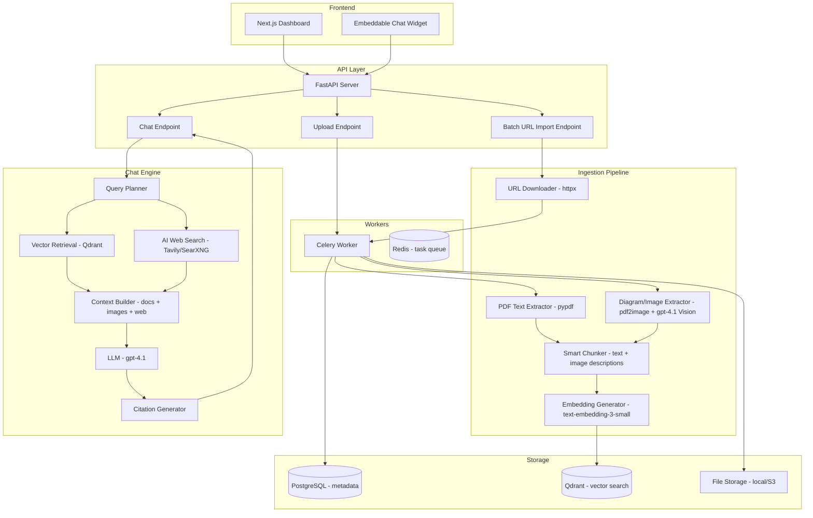
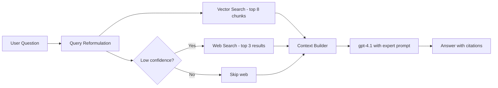

# ManualBot Backend Architecture Plan

## Overview

Redesign the ManualBot backend to be a **comprehensive technical manual expert** that can:

1. **Ingest PDFs** — manual upload + batch URL import
2. **Extract diagrams & images** from technical manuals using vision AI
3. **RAG chat** — one-shot expert answers with citations from manuals
4. **AI web search** — augment answers when docs aren't enough

The goal: **easy for the customer, expert-level answers on the first try.**

---

## Architecture Diagram



---

## Key Design Decisions

### 1. Simplify for the Customer

The user should only need to do **two things**:
- **Upload PDFs** (drag & drop, one or many)
- **Paste URLs** (one per line, batch import)

Everything else happens automatically — extraction, chunking, embedding, indexing.

### 2. Diagram/Image Extraction with Vision AI

Technical manuals are full of diagrams, schematics, wiring diagrams, and tables that `pypdf` text extraction misses entirely. The solution:

1. Convert each PDF page to an image using `pdf2image` (uses `poppler`)
2. Send pages that likely contain diagrams to **gpt-4.1 Vision** with a prompt like:
   > "Describe this technical diagram in detail. Include all labels, measurements, part numbers, connections, and relationships shown."
3. Store the image description as a chunk alongside the text chunks
4. This means when someone asks "What's the wiring diagram for X?", the vector search finds the image description and the LLM can answer accurately

**Heuristic for detecting diagram pages**: Pages where extracted text is short (< 100 words) but the page exists, OR pages containing keywords like "figure", "diagram", "schematic", "table".

### 3. AI Web Search Augmentation

When the manual doesn't have the answer, or the user asks a broader question, the chat engine can **fall back to web search**:

- Use **Tavily API** (purpose-built for AI search, returns clean text) as primary
- Fallback: **SearXNG** self-hosted or **Brave Search API**
- The web search is triggered when:
  - Vector search returns low-confidence results (score < 0.4)
  - The user explicitly asks for broader context
  - The query is about a product/model not in the uploaded docs

Web results are clearly labeled as "from web search" vs "from your documentation" in citations.

### 4. One-Shot Expert Chat

The chat engine uses a **multi-step retrieval** approach:



**Expert system prompt** designed for technical manuals:
- Understands part numbers, model numbers, specifications
- Can reference diagrams by description
- Provides step-by-step procedures when relevant
- Cites specific pages and documents
- Warns about safety-critical information

---

## Detailed Component Design

### A. Batch URL Import

**New endpoint**: `POST /api/v1/orgs/{org_id}/bots/{bot_id}/documents/batch-url`

```json
{
  "urls": [
    "https://example.com/manual-v2.pdf",
    "https://example.com/service-guide.pdf",
    "https://example.com/parts-catalog.pdf"
  ]
}
```

**Flow**:
1. Validate URLs (must end in `.pdf` or have `application/pdf` content-type)
2. Create a `Document` record for each URL with status `pending`
3. Queue a Celery task per URL that:
   - Downloads the PDF via `httpx` (with timeout, size limit, retries)
   - Saves to storage
   - Triggers the standard ingestion pipeline
4. Return immediately with document IDs and status `pending`
5. Frontend polls for status updates

**New fields on Document model**:
- `source_url: Optional[str]` — the original URL if imported via URL
- `source_type: str` — "upload" or "url"

### B. Enhanced PDF Ingestion Pipeline

The current pipeline only extracts text. The enhanced pipeline adds:

#### Step 1: Text Extraction (existing)
- `pypdf` extracts text page by page
- Same chunking logic (800 tokens, 150 overlap)

#### Step 2: Image/Diagram Extraction (new)
- `pdf2image` converts each page to a PNG image
- **Detection heuristic**: 
  - Text on page < 100 words → likely a diagram page
  - Page contains "figure", "fig.", "diagram", "schematic", "table" → likely has visual content
  - Always process if page has both text and images (mixed content)
- Send detected pages to gpt-4.1 Vision API:
  ```
  "Analyze this page from a technical manual. Describe ALL visual elements in detail:
   - Diagrams: describe connections, flow, components
   - Tables: extract all data in structured format  
   - Schematics: describe all components, labels, values
   - Photos: describe what is shown, any labels or callouts
   Include all text, numbers, part numbers, and measurements visible."
  ```
- Store the vision description as additional chunks with metadata `type: "image_description"` and `page_number`

#### Step 3: Smart Chunking (enhanced)
- Text chunks: same as before (800 tokens, 150 overlap)
- Image description chunks: stored as-is (usually 200-500 tokens)
- Each chunk gets metadata: `{type, page_number, file_name, has_diagram}`

#### Step 4: Embedding & Storage (existing)
- Generate embeddings for all chunks (text + image descriptions)
- Store in Qdrant with enhanced metadata

### C. Enhanced Chat Engine

#### Query Reformulation
Before searching, reformulate the user's question for better retrieval:
- Extract key terms (model numbers, part numbers, technical terms)
- Expand abbreviations if known
- Generate a search-optimized version of the query

#### Multi-Source Retrieval
1. **Vector search** in Qdrant (top 8 chunks, score threshold 0.3)
2. **Web search** (conditional):
   - If best vector score < 0.4 → trigger web search
   - If query contains "latest", "current", "update" → trigger web search
   - Web search returns top 3 results with snippets
3. **Context assembly**:
   - Document chunks with page references
   - Image descriptions with "[Diagram on page X]" labels
   - Web results with "[Web source: URL]" labels

#### Expert System Prompt

```
You are a technical expert assistant with deep knowledge of {product/manual name}. 
You have access to the official documentation AND web search results.

RULES:
1. Prioritize information from the official documentation
2. When referencing diagrams, describe what the diagram shows
3. For procedures, give step-by-step instructions with page references
4. For specifications, be precise with numbers and units
5. If information comes from web search, clearly note it
6. If you are unsure or the docs are ambiguous, say so
7. For safety-critical information, add appropriate warnings
8. Always cite your sources: [Document Name, Page X] or [Web: source]

DOCUMENTATION CONTEXT:
{chunks from vector search}

WEB SEARCH RESULTS:
{results from web search, if any}
```

#### Response Format
```json
{
  "answer": "The wiring diagram on page 23 shows...",
  "citations": [
    {
      "type": "document",
      "file_name": "Service Manual v2.pdf",
      "page_number": 23,
      "text_snippet": "...",
      "has_diagram": true
    },
    {
      "type": "web",
      "url": "https://...",
      "title": "...",
      "snippet": "..."
    }
  ],
  "confidence": "high",
  "sources_used": ["document", "web"],
  "answer_found": true
}
```

### D. New Dependencies

Add to `requirements.txt`:
```
# Image extraction from PDFs
pdf2image==1.17.0        # Convert PDF pages to images
Pillow==11.1.0           # Image processing

# Web search
tavily-python==0.5.0     # AI-optimized web search API

# Enhanced text processing  
tiktoken==0.9.0          # Token counting for smart chunking
```

System dependency (Dockerfile):
```dockerfile
RUN apt-get update && apt-get install -y poppler-utils
```

### E. Configuration Additions

New settings in [`config.py`](manualbot/apps/api/app/core/config.py):
```python
# Vision extraction
VISION_MODEL: str = "gpt-4.1"
ENABLE_VISION_EXTRACTION: bool = True
VISION_MIN_TEXT_THRESHOLD: int = 100  # words - below this, page likely has diagrams

# Web search
ENABLE_WEB_SEARCH: bool = True
TAVILY_API_KEY: Optional[str] = None
WEB_SEARCH_PROVIDER: str = "tavily"  # "tavily" or "brave" or "searxng"
WEB_SEARCH_MAX_RESULTS: int = 3
WEB_SEARCH_CONFIDENCE_THRESHOLD: float = 0.4  # trigger web search below this

# Enhanced chunking
MAX_CHUNKS_PER_QUERY: int = 8  # increased from 6
```

### F. Database Schema Changes

**New migration**: Add fields to `documents` table:
```sql
ALTER TABLE documents ADD COLUMN source_url TEXT;
ALTER TABLE documents ADD COLUMN source_type VARCHAR(20) DEFAULT 'upload';
```

**New migration**: Add fields to `document_chunks` table:
```sql
ALTER TABLE document_chunks ADD COLUMN chunk_type VARCHAR(20) DEFAULT 'text';
-- chunk_type: 'text', 'image_description', 'table'
ALTER TABLE document_chunks ADD COLUMN has_diagram BOOLEAN DEFAULT FALSE;
```

**New migration**: Add fields to `chat_messages` table:
```sql
ALTER TABLE chat_messages ADD COLUMN web_sources JSON;
-- Stores web search results used in the answer
```

---

## Frontend Changes (to support new backend)

### Documents Page
- Add a **"Import from URLs"** button next to the upload area
- Opens a modal with a textarea: "Paste PDF URLs, one per line"
- Shows import progress for each URL (downloading → processing → done)
- Document list shows source type icon (upload vs URL)

### Chat Page  
- Citations now show two types:
  - 📄 Document citations (existing) — with page number and diagram indicator
  - 🌐 Web citations (new) — with URL and title
- Add a small badge on answers: "From docs" / "From docs + web"

### Bot Settings
- New toggle: "Enable web search augmentation"
- New toggle: "Enable diagram extraction" 
- Slider: "Web search confidence threshold" (when to trigger web search)

---

## Implementation Plan (Todo List)

### Phase 1: Batch URL Import
1. Add `source_url` and `source_type` fields to Document model + migration
2. Create URL download service (`services/url_downloader.py`)
3. Create batch URL import endpoint
4. Add Celery task for URL download + ingestion
5. Update frontend documents page with URL import modal

### Phase 2: Diagram/Image Extraction  
6. Add `pdf2image` and `Pillow` to requirements
7. Add `poppler-utils` to Dockerfile
8. Create vision extraction service (`services/vision_extractor.py`)
9. Add `chunk_type` and `has_diagram` to DocumentChunk model + migration
10. Enhance ingestion worker to detect and process diagram pages
11. Update chunking to include image descriptions

### Phase 3: AI Web Search
12. Add `tavily-python` to requirements
13. Create web search service (`services/web_search.py`)
14. Add `web_sources` field to ChatMessage model + migration
15. Update chat engine with query reformulation
16. Add web search fallback logic to chat engine
17. Update citation format to support web sources

### Phase 4: Enhanced Chat Engine
18. Rewrite system prompt for technical manual expertise
19. Increase context window (top 8 chunks)
20. Add confidence-based routing (docs only vs docs + web)
21. Add diagram-aware responses
22. Update frontend chat to show web citations and source badges

### Phase 5: Frontend Updates
23. Add URL import modal to documents page
24. Update document list with source type indicators
25. Update chat citations to show web sources
26. Add new bot settings toggles (web search, vision extraction)

### Phase 6: Configuration & Testing
27. Update config with new settings
28. Update docker-compose if needed
29. Run typecheck and lint
30. Commit and push
31. Update memory bank

---

## Risk Considerations

| Risk | Mitigation |
|------|------------|
| gpt-4.1 Vision costs for large manuals | Only process pages detected as diagrams, cache results |
| URL downloads could be slow/fail | Timeout limits, retry logic, async download |
| Web search could return irrelevant results | Confidence threshold, clear labeling, user toggle |
| Poppler system dependency | Add to Dockerfile, document in README |
| Large PDFs could overwhelm memory | Stream processing, page-by-page extraction |
