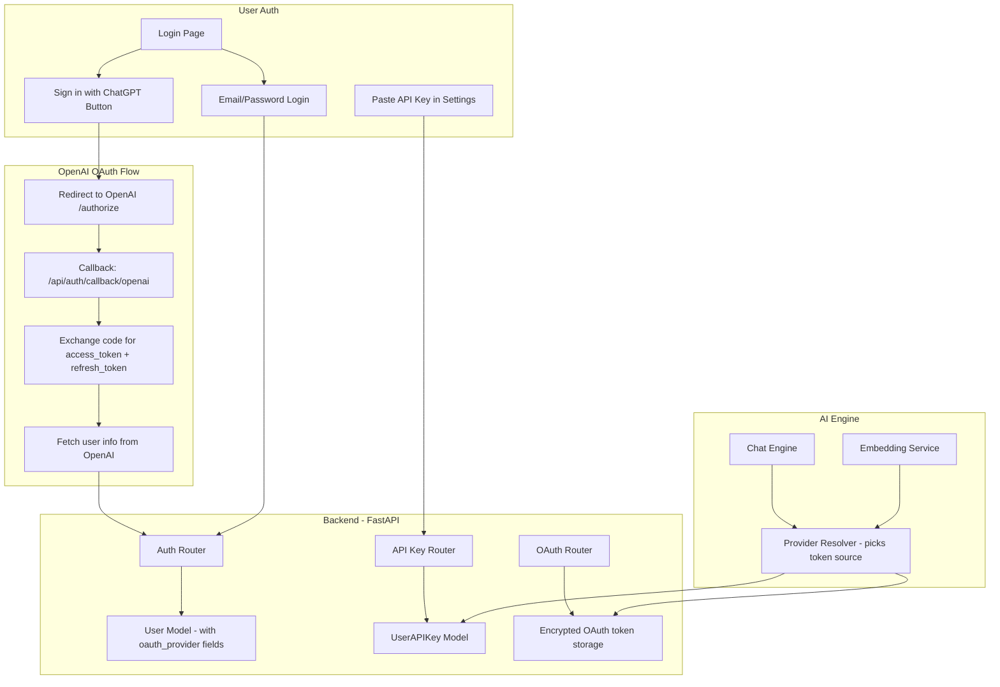

# ChatGPT OAuth + API Key Authentication Plan

## Overview

Add two authentication/authorization mechanisms to ManualBot:

1. **ChatGPT (OpenAI) OAuth Login** — Primary auth method. Users sign in with their OpenAI account. ManualBot uses their OpenAI API access to power embeddings and chat completions. This is the "big win" — users bring their own OpenAI account, eliminating API costs for ManualBot.

2. **API Key Management** — Secondary method. Users can also configure their own OpenAI API key manually in settings, or use API keys for programmatic access to ManualBot's API.

---

## Architecture Diagram



---

## Key Design Decisions

### 1. OpenAI OAuth as Primary Login

OpenAI supports OAuth 2.0 for third-party apps. The flow:

1. User clicks "Sign in with ChatGPT" on the login page
2. Redirect to OpenAI's authorization endpoint
3. User approves ManualBot's access
4. OpenAI redirects back with an authorization code
5. Backend exchanges code for access + refresh tokens
6. Backend fetches user profile from OpenAI
7. Create or link ManualBot account
8. Issue ManualBot JWT session tokens

**OpenAI OAuth endpoints:**
- Authorization: `https://auth.openai.com/authorize`
- Token exchange: `https://auth.openai.com/oauth/token`
- User info: `https://api.openai.com/v1/me` or from the token claims

**Scopes needed:**
- `openid` — basic identity
- `profile` — name, email
- `model.read` — verify model access
- `model.request` — make API calls on behalf of user

**What we store:**
- OpenAI access token (encrypted at rest)
- OpenAI refresh token (encrypted at rest)
- Token expiry timestamp
- OpenAI user ID (for account linking)

### 2. Token-Based AI Access

When a user is authenticated via OpenAI OAuth, ManualBot uses their OAuth access token to call OpenAI APIs:

```
User's OpenAI OAuth Token
    → ManualBot Chat Engine
    → OpenAI API (embeddings, completions)
    → Response back to user
```

This means:
- **No API costs for DocuBot** — users pay through their own OpenAI account
- **Users get their own rate limits** — based on their OpenAI tier
- **Model access matches their plan** — gpt-4.1 or gpt-5.2 depending on their tier

### 3. Fallback: Manual API Key

For users who prefer not to use OAuth, or for programmatic access:

- Users can paste their own OpenAI API key in the dashboard settings
- API keys are encrypted at rest (AES-256)
- Keys are validated on save (test API call)
- Keys can be rotated/deleted

### 4. Provider Resolution Order

When the chat engine needs to make an OpenAI API call, it resolves the token in this order:

1. **User's OAuth token** — if user logged in via OpenAI OAuth
2. **User's manual API key** — if user pasted one in settings
3. **System API key** — fallback to ManualBot's own key (if configured, for free tier)

### 5. Account Linking

Users who first register with email/password can later link their OpenAI account:
- Go to Settings → Connected Accounts
- Click "Connect OpenAI Account"
- Complete OAuth flow
- Account is linked, AI features now use their token

---

## Database Changes

### User Model Updates

Add to `users` table:

```sql
ALTER TABLE users ADD COLUMN oauth_provider VARCHAR(50);        -- 'openai', null for email/password
ALTER TABLE users ADD COLUMN oauth_provider_id VARCHAR(255);    -- OpenAI user ID
ALTER TABLE users ADD COLUMN oauth_access_token TEXT;           -- Encrypted
ALTER TABLE users ADD COLUMN oauth_refresh_token TEXT;          -- Encrypted
ALTER TABLE users ADD COLUMN oauth_token_expires_at TIMESTAMP;
ALTER TABLE users ADD COLUMN hashed_password VARCHAR(255) NULL; -- Make nullable for OAuth-only users
```

### New Table: user_api_keys

```sql
CREATE TABLE user_api_keys (
    id UUID PRIMARY KEY DEFAULT gen_random_uuid(),
    user_id UUID NOT NULL REFERENCES users(id) ON DELETE CASCADE,
    name VARCHAR(255) NOT NULL,              -- "My OpenAI Key", "Production Key"
    provider VARCHAR(50) NOT NULL DEFAULT 'openai',  -- 'openai', 'anthropic', etc.
    encrypted_key TEXT NOT NULL,             -- AES-256 encrypted API key
    key_prefix VARCHAR(10) NOT NULL,         -- "sk-...abc" for display
    is_active BOOLEAN NOT NULL DEFAULT true,
    last_used_at TIMESTAMP,
    created_at TIMESTAMP NOT NULL DEFAULT now(),
    updated_at TIMESTAMP NOT NULL DEFAULT now()
);

CREATE INDEX idx_user_api_keys_user_id ON user_api_keys(user_id);
```

### New Table: manualbot_api_keys (for programmatic API access)

```sql
CREATE TABLE manualbot_api_keys (
    id UUID PRIMARY KEY DEFAULT gen_random_uuid(),
    user_id UUID NOT NULL REFERENCES users(id) ON DELETE CASCADE,
    organization_id UUID NOT NULL REFERENCES organizations(id) ON DELETE CASCADE,
    name VARCHAR(255) NOT NULL,
    hashed_key VARCHAR(255) NOT NULL,        -- bcrypt hash of the full key
    key_prefix VARCHAR(20) NOT NULL,         -- "mb_abc123..." for display
    is_active BOOLEAN NOT NULL DEFAULT true,
    last_used_at TIMESTAMP,
    expires_at TIMESTAMP,
    created_at TIMESTAMP NOT NULL DEFAULT now()
);
```

---

## API Endpoints

### OAuth Endpoints

| Method | Path | Description |
|--------|------|-------------|
| GET | `/api/v1/auth/oauth/openai` | Initiate OpenAI OAuth flow (returns redirect URL) |
| GET | `/api/v1/auth/oauth/openai/callback` | Handle OAuth callback, exchange code, create/link user |
| POST | `/api/v1/auth/oauth/openai/link` | Link OpenAI account to existing user |
| DELETE | `/api/v1/auth/oauth/openai/unlink` | Unlink OpenAI account |
| GET | `/api/v1/auth/oauth/openai/status` | Check if OpenAI is connected + token validity |

### API Key Management Endpoints

| Method | Path | Description |
|--------|------|-------------|
| GET | `/api/v1/settings/api-keys` | List user's API keys (provider keys like OpenAI) |
| POST | `/api/v1/settings/api-keys` | Add a new API key |
| DELETE | `/api/v1/settings/api-keys/{key_id}` | Delete an API key |
| POST | `/api/v1/settings/api-keys/{key_id}/validate` | Test if an API key works |

### ManualBot API Key Endpoints (for programmatic access)

| Method | Path | Description |
|--------|------|-------------|
| GET | `/api/v1/settings/manualbot-keys` | List ManualBot API keys |
| POST | `/api/v1/settings/manualbot-keys` | Create a new ManualBot API key |
| DELETE | `/api/v1/settings/manualbot-keys/{key_id}` | Revoke a ManualBot API key |

---

## Frontend Changes

### Login Page

Add a prominent "Sign in with ChatGPT" button above the email/password form:

```
┌─────────────────────────────────┐
│         ManualBot Logo          │
│                                 │
│  ┌───────────────────────────┐  │
│  │  🤖 Sign in with ChatGPT │  │  ← Primary CTA (green/OpenAI branded)
│  └───────────────────────────┘  │
│                                 │
│  ──────── or continue with ──── │
│                                 │
│  Email: [________________]      │
│  Password: [______________]     │
│  [Sign in]                      │
│                                 │
│  Demo credentials: ...          │
└─────────────────────────────────┘
```

### Dashboard Settings Page (new section)

Add "Connected Accounts" and "API Keys" sections:

```
Settings
├── Connected Accounts
│   ├── OpenAI: Connected as user@email.com ✅ [Disconnect]
│   └── (future: Anthropic, etc.)
├── API Keys (Provider)
│   ├── "My OpenAI Key" sk-...abc [Active] [Delete]
│   └── [+ Add API Key]
└── ManualBot API Keys (Programmatic Access)
    ├── "Production" mb_abc... [Active] [Revoke]
    └── [+ Create API Key]
```

### Auth Store Updates

Update [`src/store/auth.ts`](src/store/auth.ts) to track:
- `oauthProvider: 'openai' | null`
- `hasOpenAIConnection: boolean`
- OAuth login flow state

---

## Security Considerations

| Concern | Mitigation |
|---------|------------|
| OAuth token storage | Encrypt at rest with AES-256, key from env var |
| API key storage | Encrypt with AES-256, only show prefix in UI |
| CSRF on OAuth callback | Use `state` parameter with HMAC signature |
| Token refresh | Background job refreshes OAuth tokens before expiry |
| Rate limiting | Per-user rate limits on API key validation endpoint |
| Key leakage | Never log or return full keys after creation |

---

## Configuration Additions

New settings in [`config.py`](manualbot/apps/api/app/core/config.py):

```python
# OpenAI OAuth
OPENAI_OAUTH_CLIENT_ID: Optional[str] = None
OPENAI_OAUTH_CLIENT_SECRET: Optional[str] = None
OPENAI_OAUTH_REDIRECT_URI: str = "http://localhost:3000/api/auth/callback/openai"
OPENAI_OAUTH_SCOPES: str = "openid profile"

# Encryption for stored tokens/keys
ENCRYPTION_KEY: str = "change-me-generate-with-fernet"  # Fernet key for AES

# Feature flags
ENABLE_OAUTH_LOGIN: bool = True
ENABLE_API_KEY_MANAGEMENT: bool = True
REQUIRE_OWN_API_KEY: bool = False  # If true, users must provide their own key
```

---

## Implementation Plan

### Phase 1: Backend OAuth Infrastructure
1. Update User model with OAuth fields + migration
2. Add encryption utilities for token/key storage
3. Create OpenAI OAuth endpoints (initiate, callback, link/unlink)
4. Add OAuth config settings
5. Update `get_current_user` dependency to handle OAuth users

### Phase 2: API Key Management Backend
6. Create UserAPIKey model + migration
7. Create ManualBotAPIKey model + migration
8. Build API key CRUD endpoints
9. Add key validation endpoint (test OpenAI key)
10. Add API key auth middleware for programmatic access

### Phase 3: Provider Resolution
11. Create ProviderResolver service
12. Update chat engine to use resolved provider token
13. Update embedding service to use resolved provider token
14. Add token refresh background task

### Phase 4: Frontend - Auth Flow
15. Add "Sign in with ChatGPT" button to login page
16. Add "Sign in with ChatGPT" button to register page
17. Handle OAuth callback in frontend (redirect flow)
18. Update auth store for OAuth state
19. Add OAuth loading/error states

### Phase 5: Frontend - Settings
20. Add "Connected Accounts" section to settings
21. Add "API Keys" management UI
22. Add "ManualBot API Keys" management UI
23. Add key creation modal with copy-to-clipboard
24. Add key validation feedback

### Phase 6: Integration & Polish
25. Wire mock data to support OAuth demo flow
26. Add proper error handling for expired/invalid tokens
27. Update landing page to highlight "Sign in with ChatGPT"
28. Run typecheck and lint
29. Commit, push, update memory bank

---

## Dependencies

### Backend (Python)
```
httpx>=0.27.0          # OAuth HTTP calls
cryptography>=44.0.0   # Fernet encryption for stored tokens
```

### Frontend (npm/bun)
No new dependencies needed — OAuth is a redirect flow handled by the browser.

---

## Risk Considerations

| Risk | Mitigation |
|------|------------|
| OpenAI OAuth availability | May need to apply for OAuth app approval; fallback to API key |
| OAuth token expiry during long sessions | Background refresh + graceful re-auth prompt |
| Users hitting their own OpenAI rate limits | Show clear error: "Your OpenAI account rate limit reached" |
| Encryption key rotation | Support key versioning in encrypted fields |
| OpenAI changes OAuth scopes | Abstract OAuth provider for easy updates |
