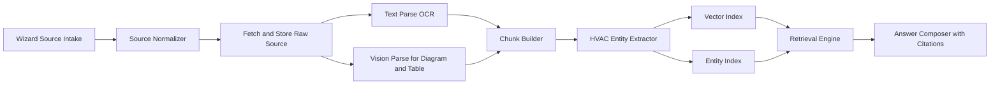

# DocuChat Full V1 Design Plan

## Goal
Enable customers to quickly create a production-ready technical chatbot that:
- Ingests manuals via file upload and batched manual URLs
- Organizes all sources into a Manual Library
- Understands text, tables, diagrams, wiring, venting, framing, clearances, and installation constraints
- Produces grounded answers with citations and confidence

---

## 1. New Bot Guided Wizard UX

### Entry Point
- Button: `New Bot`
- Opens a full-screen 5-step wizard instead of a simple modal

### Step 1 - Bot Identity
- Fields:
  - Bot name
  - Use case preset `Installation Support` `Service Troubleshooting` `Sales + Spec Lookup` `Custom`
  - Audience `Internal Techs` `Homeowners` `Dealers`
- Auto defaults:
  - `citation_mode` true
  - `strict_mode` true
  - model profile `gpt-4.1-mini` for chat
- Validation:
  - name required
  - preset required

### Step 2 - Source Intake Setup
- Two ingestion lanes on one screen:
  - Upload files drag and drop
  - Paste manual URLs one per line or bulk paste
- URL pre-check before submit:
  - reachable URL
  - content type detection PDF HTML DOC
  - duplicate detection
- Source grouping fields:
  - Brand
  - Product line
  - Model numbers list
  - Fuel type and category tags

### Step 3 - Parsing and Knowledge Preferences
- Toggles:
  - Extract tables
  - Diagram analysis
  - OCR fallback for scanned pages
  - HVAC entity extraction
- HVAC extraction classes:
  - venting
  - framing
  - wiring
  - mantel and appliance clearances
  - gas pressure and orifice specs
  - dimensions and installation constraints
- User sees estimated processing profile and expected completeness checks

### Step 4 - Verification Playground
- Auto-generated test panel after first ingest pass:
  - asks canonical questions from detected entities
  - highlights missing or low-confidence areas
- Admin can add golden test questions and expected citation source
- Must pass minimum quality gate to enable publish

### Step 5 - Publish and Embed
- Channel options:
  - Web widget
  - Internal support console
- Policy controls:
  - strict docs-only
  - escalation message
  - allowed domains
- Final checklist:
  - sources indexed
  - diagram extraction coverage
  - confidence score threshold met

---

## 2. Manual Library IA

### Library Structure
- Library root scoped by organization
- Collections:
  - Brand
  - Product family
  - Model group
  - Region and code version optional

### Source Types
- Uploaded files
- Imported URLs
- Future connectors placeholder

### Source Record Fields
- Source id
- Type file or URL
- Canonical URL and last fetched hash
- File metadata page count size mime
- Classification brand model fuel appliance type
- Processing status queued processing completed failed stale
- Extraction metrics pages parsed tables extracted diagrams analyzed entities found
- Coverage metrics by entity class

### Library Views
- Grid and table modes
- Faceted filters by brand model type status entity coverage
- Bulk actions:
  - reprocess
  - retag
  - archive
  - remove

---

## 3. Ingestion + Intelligence Pipeline

### Pipeline Stages
1. Source normalization
   - dedupe by URL canonicalization and content hash
2. Document parsing
   - text extraction from PDF and HTML
   - OCR fallback for scans
3. Vision parsing
   - page-level image analysis for wiring and venting diagrams
   - structured table extraction to key-value rows
4. Semantic chunking
   - chunk text and vision outputs with overlap and typed metadata
5. HVAC entity extraction
   - rule + LLM extraction with normalized schema
6. Indexing
   - vector index for semantic retrieval
   - entity index for hard constraint lookups
7. Evaluation hooks
   - run benchmark question set and coverage scoring

---

## 4. Retrieval and Answer Strategy

### Retrieval Blend
- Hybrid retrieval
  - semantic vector search
  - entity constraint lookup
  - metadata filter by model and brand
- Query planner detects intent classes:
  - installation
  - clearance requirement
  - wiring path
  - venting requirement
  - troubleshooting

### Grounded Answer Rules
- Always provide citations from source pages
- Show confidence `high` `medium` `low`
- For low confidence:
  - state uncertainty
  - present best related sections
  - suggest escalation path
- For conflicting manuals:
  - show conflict notice
  - include model and revision context

---

## 5. Data Model and API Contract Plan

### New Data Concepts
- `library_sources`
- `library_collections`
- `source_fetch_runs`
- `ingestion_jobs`
- `parsed_artifacts`
- `entity_facts`
- `golden_questions`
- `quality_reports`

### Core API Surface
- `POST /api/v1/organizations/{orgId}/bots/wizard/init`
- `PATCH /api/v1/organizations/{orgId}/bots/wizard/{wizardId}/step/{stepId}`
- `POST /api/v1/organizations/{orgId}/bots/{botId}/sources/upload`
- `POST /api/v1/organizations/{orgId}/bots/{botId}/sources/import-urls`
- `GET /api/v1/organizations/{orgId}/bots/{botId}/library`
- `POST /api/v1/organizations/{orgId}/bots/{botId}/library/reprocess`
- `GET /api/v1/organizations/{orgId}/bots/{botId}/quality-report`
- `POST /api/v1/organizations/{orgId}/bots/{botId}/publish`

---

## 6. Quality Gates Before Publish

### Required Gates
- Source ingest success ratio above threshold
- Entity coverage minimum for venting framing wiring clearance
- Golden question pass ratio above threshold
- Citation validity checks pass

### Optional Advanced Gate
- Hallucination guardrail run over safety-critical questions

---

## 7. Admin and Operator Screens

- Wizard progress dashboard
- Manual Library with processing diagnostics
- Failed source queue with one-click retry and reason codes
- Quality report screen with gap analysis by entity class
- Runtime monitor for unresolved chat intents

---

## 8. Continuous Document Growth After Launch

### Add More Documents Later
- Every bot gets an always-available `Add Sources` action in:
  - Bot overview
  - Manual Library
  - Quality report page when coverage gaps are detected
- `Add Sources` supports:
  - Single or bulk file upload
  - Batch URL paste
  - Import into existing collection or new collection

### Incremental Retraining Model
- New sources do incremental ingest and index updates without wiping prior knowledge
- Existing source updates create a new source revision and keep audit history
- Chat engine always targets latest approved revision by default

### Safe Update Controls
- `Draft ingest` mode for new sources
- `Promote to active` once quality checks pass
- Rollback to prior revision if regression is detected

### Post-Launch UX Requirements
- Users can continuously expand a bot knowledge base with no downtime
- Library shows what is new, updated, stale, archived
- Each source has revision history and reprocess controls

---

## 9. Approved Website Crawl and Update Architecture

### Approved Source Registry
- Per bot allowlist of approved domains and paths
- Optional crawl seeds by brand and model families
- Blocklist patterns for pages to ignore

### Crawl Modes
- Scheduled crawl daily weekly custom interval
- Manual crawl now action
- Event-driven recrawl for newly discovered docs under approved paths

### Change Detection
- URL canonicalization
- Content hash and structural diff
- Document fingerprinting for PDF and HTML extracts
- Change classes `new` `updated` `removed` `moved`

### Crawl Pipeline
1. Discover URLs from approved seeds
2. Fetch and validate against allowlist
3. Detect manual-like assets PDF HTML docs
4. Compare hash against prior revision
5. Queue ingest only for changed or new items
6. Run same parsing and quality gate flow
7. Publish revisions after passing checks

### Governance and Security
- Respect robots and configured rate limits
- Tenant-scoped crawl workers and quotas
- Full crawl audit logs and source provenance records

### Operator Controls
- Crawl dashboard with status, pages scanned, changes found
- Approve auto-discovered sources before activation optional policy
- Alerting on crawl failures and source drift

---

## 10. Phased Delivery Blueprint

### Phase A
- Wizard shell
- File + URL intake
- Library data model and listing UI

### Phase B
- Full parsing pipeline with OCR and table extraction
- Initial diagram analysis path
- Entity extraction baseline

### Phase C
- Quality gates and verification playground
- Publish flow enforcement
- Admin diagnostics

### Phase D
- Retrieval optimization and conflict handling
- Benchmark suite expansion for HVAC scenarios
- Operational hardening and observability

---

## 9. Risks and Mitigations

- Inconsistent manual formats
  - mitigation multi-parser fallback and robust OCR
- Diagram ambiguity
  - mitigation dual pass vision + rule post-processing
- URL source drift
  - mitigation scheduled refetch with hash diff
- Safety-critical answer risk
  - mitigation strict citation policy and low-confidence fallback

---

## 10. Acceptance Criteria

- User can complete wizard and publish bot without leaving flow
- User can upload files and batch URL manuals into one library
- Bot answers include citations and confidence
- Bot can answer core HVAC manual questions on venting framing wiring clearances with traceable source grounding
- Admin can identify and fix ingestion failures and quality gaps from dedicated screens
